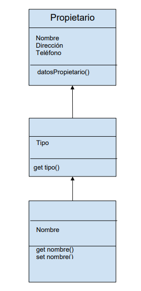

# Desafío opcional - Lista de animales

La clínica veterinaria Pet-XYZ requiere de un sistema en línea para que los médicos
veterinarios y asistentes puedan guardar la información de tres tipo de animales en
específico, como es el caso de Perros, Gatos y Conejos, debido a que son la mayor demanda
por cantidad de casos al día por los momentos. Esto se realizará mediante la utilización de
un formulario para identificar el tipo y datos del animal, en conjunto con los datos del dueño. 

Por lo tanto, el desafío consiste en llevar a un archivo JavaScript un modelo de Herencia
(diagrama de clases) en específico, como se muestra en la primera imagen, implementado la
nomenclatura de ES6, para así facilitar a los usuarios de la aplicación (clínica veterinaria)
identificar a los animales y a sus dueños. Es importante recalcar, que cada dueño tiene una
mascota y se pueden seleccionar solo tres tipos de mascotas: perros, gatos o conejos,
igualmente se debe ingresar el motivo de la consulta o enfermedad con el nombre del animal
y los datos del dueño (nombre, dirección y número telefónico) como se muestran en el
formulario en la imagen 2. Todo esto con el propósito que se despliegue una lista al final del
formulario con los datos del dueño y de la mascota, incluyendo la enfermedad o motivo de la
consulta.
Utilizar el siguiente modelo de Herencia (diagrama de clases) como base:

