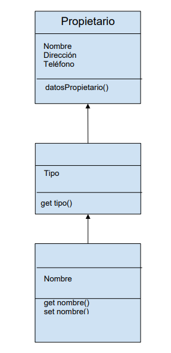
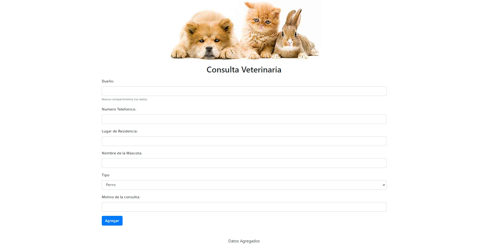

# Desafío Opcional - Lista de Animales

## Descripción

La clínica veterinaria **Pet-XYZ** requiere un sistema en línea para que los médicos veterinarios y asistentes puedan registrar la información de tres tipos de animales: perros, gatos y conejos. El sistema debe permitir ingresar los datos del dueño y de la mascota a través de un formulario web, y mostrar los datos ingresados en una lista.

El desafío consiste en implementar un modelo de herencia en JavaScript utilizando ES6, siguiendo el diagrama de clases proporcionado. El objetivo es permitir a los usuarios de la clínica identificar a los animales y sus dueños, y mostrar la información ingresada en 
una lista.

Utilizar el siguiente modelo de Herencia (diagrama de clases) como base:

## Vista Codificada

A continuación, se muestra la imagen del resultado codificado:

## Requerimientos

1. **Crear las Clases en ES6**:
   - Implementar las clases siguiendo la herencia indicada en el diagrama de clases.
   - Utilizar la nomenclatura y características de ES6.

2. **Métodos Get y Set**:
   - Crear métodos `get` y `set` para la clase `Mascota`.

3. **Método Get para Tipo**:
   - Crear un método `get` en la clase `Animal` para la propiedad `tipo`, que retorne el mensaje: `"El tipo de animal es un: ${this.tipo}"`.

4. **Método `datosPropietario`**:
   - Implementar el método `datosPropietario` en la clase correspondiente, que pueda ser accedido desde las clases derivadas.

5. **Captura de Elementos del Formulario**:
   - Captar los elementos del formulario con JavaScript.
   - Identificar el tipo de animal seleccionado para crear la instancia correspondiente de la clase `Mascota`.

6. **Mostrar Datos**:
   - Mostrar una lista con los datos del propietario y la mascota, incluyendo el motivo de la consulta, cuando el usuario haga clic en el botón "Agregar".

## Autor

Este proyecto fue desarrollado por **Valeria Torrealba**.
